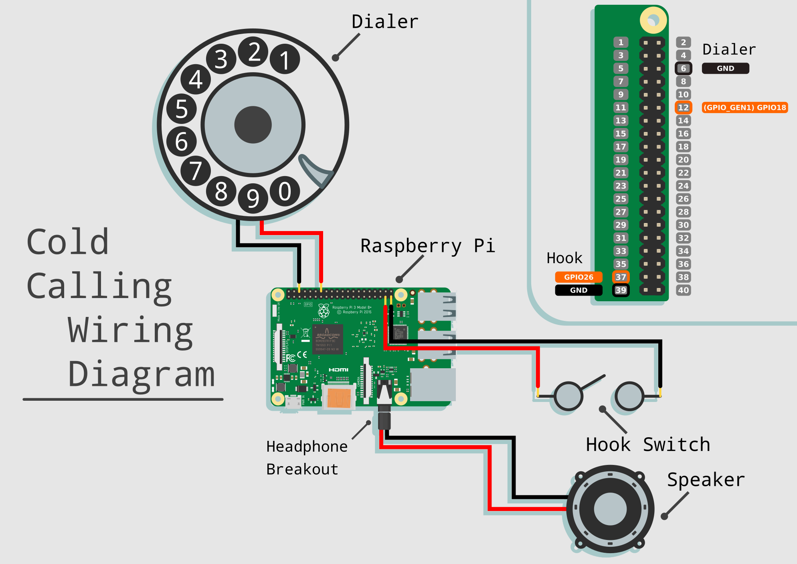

# Cold-Calling
An Electronic Literature project.

----

## Documentation

***Work in progress***

### Materials:

* Raspberry Pi 3
* Raspberry Pi graded PSU
* Rotary Phone 1
* Assorted Wires
* Soldering Iron
* Momentary Switch 2
* 3.5mm TRRS Audio Plug 3

>1. It is likely that your phones internals will vary from other models, however the phone should work as long as all the electronics are easily accessible and the dial uses >electric pulses to input numbers. This will be covered more thoroughly later

>2. Depending on the internals of your particular phone you may be able to use the built in switch for the handset hook/cradle, otherwise you will have to >mount your own switch to the inside of the phone that gets pressed by the handset hook/cradle

>3. The TRRS plug is used to connect to the wires of the handset speaker so that it can be plugged directly into the Raspberry Pi's audio jack. This can also be salvaged from an old pair of headphones or an aux cable. Alternatively the speaker wires can be soldered directly to the audio jack pins on the >underside of the Pi's PCB 

----

----

## Important Notes:
* Audio files are not currently available through this repository
* All audio files must be within the subfolder `Audio/`